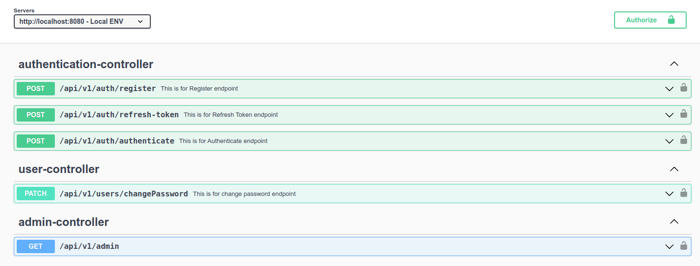
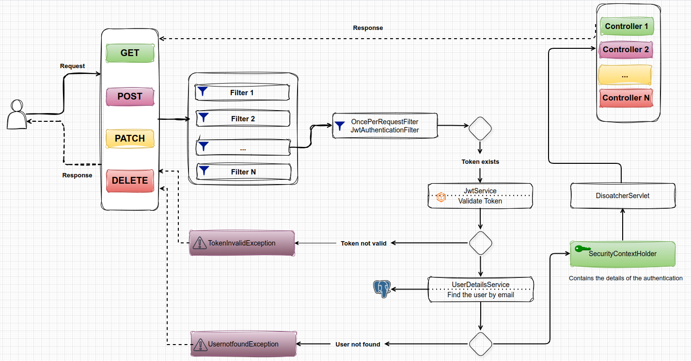
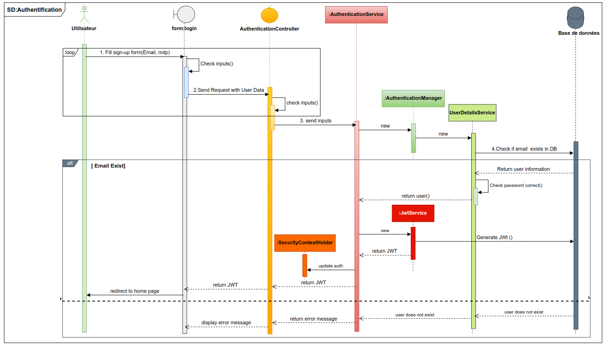
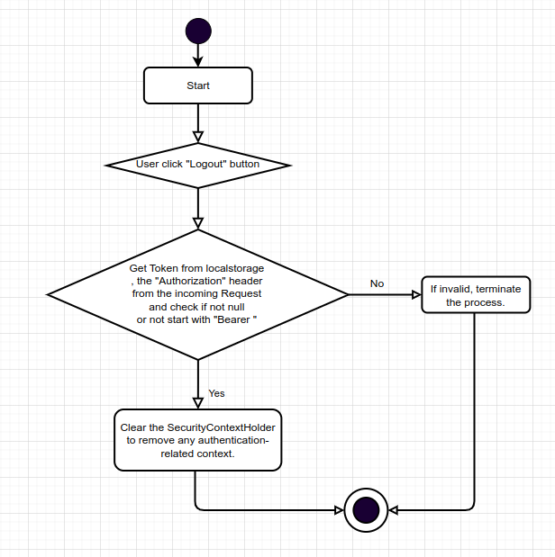

# Spring Boot 3.0 Security with JWT Implementation
This project demonstrates the implementation of security using Spring Boot 3.0 and JSON Web Tokens (JWT). It includes the following features:

## Features

For further reference, please consider the following sections:

* User registration and login with JWT authentication
* Password encryption using BCrypt
* Role-based authorization with Spring Security
* Logout mechanism
* Refresh token

## Technologies

* _Spring Boot 3.0_
* _Spring Security_
* _JSON Web Tokens (JWT)_
* _BCrypt_
* _Maven_
* _JSR-303 and Spring Validation_
* _OpenAPI and Swagger UI Documentation_

#### OpenApi Documentation

#### Authentication Flow 

#### Sign In Sequence Diagram 

#### Logout Activity Diagram 

